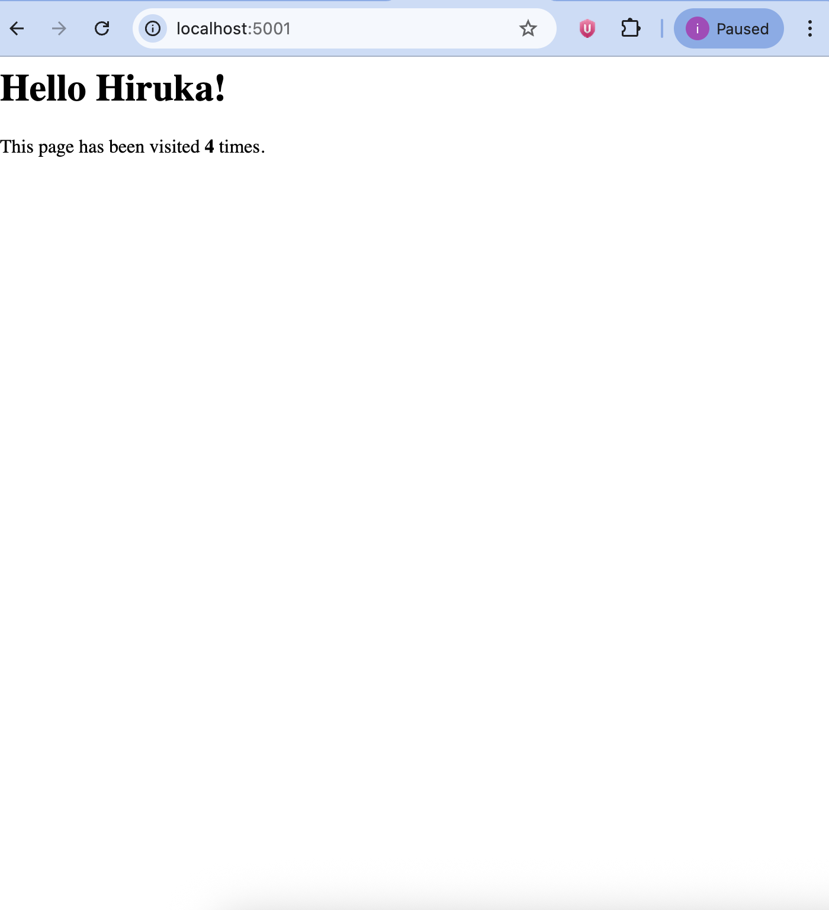

# Dynamic Python-Redis Stack with Docker Compose 🚀🐍

This project demonstrates a full-stack containerized architecture. It uses a **Python (Flask)** backend that connects to a **Redis** database to track and display page visit counts.

## 🛠️ Tech Stack
- **Backend:** Python 3.9 (Flask)
- **Database:** Redis (NoSQL)
- **Orchestration:** Docker Compose
- **Environment:** Containerized via Docker

## 🏗️ Architecture
The Python application and Redis database run in separate containers but communicate over a private Docker network. The app uses the `depends_on` property to ensure the database is ready before the backend starts.

## 🚀 How to Run
1. Clone the repository:
   ```bash
   git clone [https://github.com/HirukaWarnakula/hiru-python-redis-compose.git](https://github.com/HirukaWarnakula/hiru-python-redis-compose.git)

2. Run the stack:

    docker-compose up --build -d

3. Access the application at:http://localhost:5001

📸 Preview
📸 Preview 

Developed by Hiruka Warnakula - Aspiring DevOps Engineer.